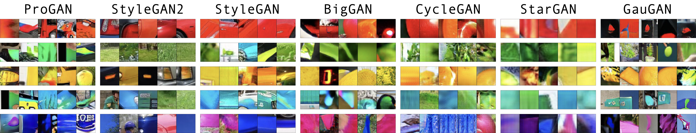
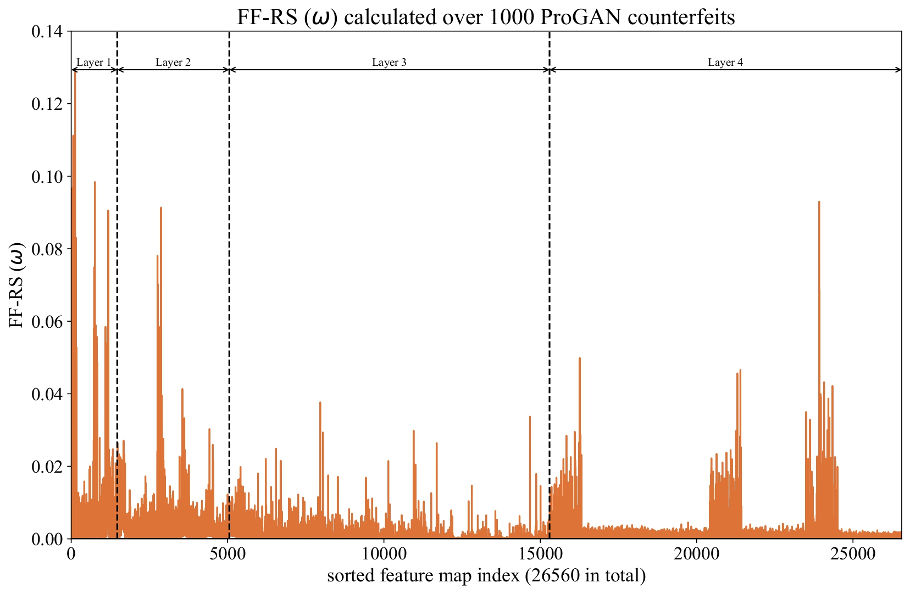

<h1 align='center' style="text-align:center; font-weight:bold; font-size:2.0em;letter-spacing:2.0px;">
                Discovering Transferable Forensic Features</br>for CNN-generated Images Detection</h1>
<p align='center' style="text-align:center;font-size:1.25em;">
    <a href="https://keshik6.github.io/" target="_blank" style="text-decoration: none;">Keshigeyan&nbsp;Chandrasegaran</a>&nbsp;<sup>1</sup>&nbsp;/&nbsp;
    <a href="https://scholar.google.com/citations?hl=en&user=9SE3GYMAAAAJ" target="_blank" style="text-decoration: none;">Ngoc&#8209;Trung&nbsp;Tran&nbsp;</a><sup>1</sup>&nbsp;/&nbsp;
    <a href="https://scholar.google.de/citations?user=5B8CTlEAAAAJ&hl=de" target="_blank" style="text-decoration: none;">Alexander&nbsp;Binder</a>&nbsp;<sup>2,3</sup>&nbsp;/&nbsp;
    <a href="https://sites.google.com/site/mancheung0407/" target="_blank" style="text-decoration: none;">Ngai&#8209;Man&nbsp;Cheung</a>&nbsp;<sup>1</sup></br>
<sup>1</sup>&nbsp;Singapore University of Technology and Design (SUTD)<br/>
            <sup>2</sup>&nbsp;Singapore Institute of Technology&nbsp;(SIT)&nbsp;&nbsp;&nbsp;&nbsp;&nbsp;&nbsp;&nbsp;&nbsp;
            <sup>3</sup>&nbsp;University&nbsp;of&nbsp;Oslo&nbsp;(UIO)<br/>
<em>ECCV&nbsp;2022&nbsp;Oral</br></em>
<a href="https://keshik6.github.io/transferable-forensic-features/" title="Project" target="_blank" rel="nofollow" style="text-decoration: none;">Project</a> |
<a href="https://arxiv.org/abs/2208.11342" title="ECCV Paper" target="_blank" rel="nofollow" style="text-decoration: none;">ECCV Paper</a> |
<a href="https://drive.google.com/drive/folders/1MU8xCdK-ihxk1l2OHNYzjF76AMgs70Fk?usp=sharing" title="Pre-trained Models" target="_blank" rel="nofollow" style="text-decoration: none;">Pre-trained Models</a>
</p>


### Table of Contents

- [Abstract](#abstract)
- [About the code](#about-the-code)
- [Running the code](#running-the-code)
  * [Pre-requistes](#pre-requistes)
  * [Input-space Attribution methods](#input-space-attribution-methods)
  * [Transferable forensic features](#transferable-forensic-features)
  * [Training Color Robust Universal Detectors](#training-color-robust-universal-detectors)
- [Sensitivity Assessment results using Forensic feature map dropout](#sensitivity-assessment-results-using-forensic-feature-map-dropout)
  * [ResNet-50 Detector](#resnet-50-detector)
  * [EfficientNet-B0 Detector](#efficientnet-b0-detector)
- [Color Robust (CR) Universal Detector Results](#color-robust--cr--universal-detector-results)
  * [CR-ResNet-50 Detector](#cr-resnet-50-detector-1)
  * [CR-EfficientNet-B0 Detector](#cr-efficientnet-b0-detector-1)
- [FAQ](#faq)
- [Citation](#citation)
- [Acknowledgements](#acknowledgements)
- [References](#references)


## Abstract

Visual counterfeits are increasingly causing an existential conundrum in mainstream media with rapid evolution in neural image synthesis methods. Though detection of such counterfeits has been a taxing problem in the image forensics community, a recent class of forensic detectors – universal detectors – are able to surprisingly spot counterfeit images regardless of generator architectures, loss functions, training datasets, and resolutions. This intriguing property suggests the possible existence of transferable forensic features (T-FF) in universal detectors. In this work, we conduct the first analytical study to discover and understand T-FF in universal detectors. Our contributions are 2-fold: 1)We propose a novel forensic feature relevance statistic (FF-RS) to quantify and discover T-FF in universal detectors and, 2) Our qualitative and quantitative investigations uncover an unexpected finding: color is a critical T-FF in universal detectors. 




## About the code

This codebase is written in Pytorch. We also provide the Docker file to run our code. The codebase is clearly documented with clear instructions to run all the code.  The code is structured as follows:

- `lrp/`: Base Pytorch module containing LRP implementations for ResNet and EfficientNet architectures. This includes all Pytorch wrappers.
- `fmap ranking/`: Pytorch module to calculate FF-RS (ω) for counterfeit detection
- `sensitivity assessment/`: Pytorch module to perform sensitivity assessments for T-FF and color ablation.
- `patch extraction/`: Pytorch module to extract LRP-max response image regions for every T-FF.
- `activation histograms/`: Pytorch module to calculate maximum spatial activation for images for every T-FF.
- `utils/`: Contains all utilities, helper functions and plotting functions.


:heavy_check_mark: Pytorch

:heavy_check_mark: DockerFile


## Running the code

### Pre-requistes

Install dependencies, download ForenSynths dataset and pre-trained models.

1. Create a new virtual environment and install all the dependencies
    `pip3 install -r requirements.txt --extra-index-url https://download.pytorch.org/whl/lts/1.8/cu111`
2. Download and unzip ForenSynths test dataset by Wang et al. [here](https://drive.google.com/file/d/1z_fD3UKgWQyOTZIBbYSaQ-hz4AzUrLC1/view) [[1]](#1). We assume the dataset is saved at `/mnt/data/CNN_synth_testset/ `
2. Download and unzip ForenSynths validation dataset by Wang et al. [here](https://drive.google.com/file/d/1FU7xF8Wl_F8b0tgL0529qg2nZ_RpdVNL/view) [[1]](#1). We assume the dataset is saved at `/mnt/data/progan_val/ `
3. Download pre-trained models and place it in `weights/` directory. We also include the weights for ResNet-50 model published by Wang et al [[1]](#1) as well. The models are available [here](https://drive.google.com/drive/folders/1MU8xCdK-ihxk1l2OHNYzjF76AMgs70Fk?usp=sharing).


### Input-space Attribution methods

|                 | Universal Detector [[1]](#1) | ImageNet Classifier | Guided-GradCAM [[2]](#2) | LRP [[3]](#3)      |                                                              |
| --------------- | ---------------------------- | ------------------- | ------------------------ | ------------------ | ------------------------------------------------------------ |
| ResNet-50       | :heavy_check_mark:           |                     | :heavy_check_mark:       |                    | `python src/gradcam.py --arch resnet50 --classifier ud`      |
| EfficientNet-B0 | :heavy_check_mark:           |                     | :heavy_check_mark:       |                    | `python src/gradcam.py --arch efb0 --classifier ud`          |
| ResNet-50       |                              | :heavy_check_mark:  | :heavy_check_mark:       |                    | `python src/gradcam.py --arch resnet50 --classifier imagenet` |
| EfficientNet-B0 |                              | :heavy_check_mark:  | :heavy_check_mark:       |                    | `python src/gradcam.py --arch efb0 --classifier imagenet`    |
| ResNet-50       | :heavy_check_mark:           |                     |                          | :heavy_check_mark: | `python src/ud_lrp.py --arch resnet50 --classifier ud`       |
| EfficientNet-B0 | :heavy_check_mark:           |                     |                          | :heavy_check_mark: | `python src/ud_lrp_efb0.py --arch efb0 --classifier ud`      |
| ResNet-50       |                              | :heavy_check_mark:  |                          | :heavy_check_mark: | `python src/imagenet_lrp.py`                                 |
| EfficientNet-B0 |                              | :heavy_check_mark:  |                          | :heavy_check_mark: | `python src/imagenet_lrp_efb0.py --arch efb0 --classifier imagenet` |


### Transferable forensic features

We include step-by-step instructions for running / reproducing all the results / analysis in our paper. We use ResNet-50 detector and StyleGAN2 images for the following examples. To run analysis using EfficientNetB0 detector, simply pass  `--arch efb0 --topk 27` . To analyse other unseen GANs (i.e.: BigGAN), simply pass `--gan_name biggan `.

1. Calculate FF-RS (ω) for ProGAN validation set : For ease, we provide pre-calculated FF-RS (ω) values for all detectors in the `fmap_relevances/` directory, so you may skip this step if you wish.

   `python src/rank_fmaps.py --arch resnet50 --blur_jpg 0.5 --bsize 16 --dataset_dir /mnt/data/ --gan_name progan_val --have_classes True --num_real 50 --num_fake 50 --save_pt_files False`

2. Perform Sensitiity Assessments on StyleGAN2 (Unseen GAN)

   `python src/transfer_sensitivity_analysis.py --arch resnet50 --blur_jpg 0.5 --bsize 256 --dataset_dir /mnt/data/CNN_synth_testset/ --gan_name stylegan2 --have_classes 1 --num_instances 200 --topk 114`

3. Extract LRP-max patches for StyleGAN2 (Unseen GAN)

   `python src/get_max_activation_rankings.py --arch resnet50 --blur_jpg 0.5 --bsize 256 --dataset_dir /mnt/data/CNN_synth_testset/ --gan_name stylegan2 --have_classes 1 --num_instances 200 --topk 114`

   `python src/extract_max_activation_patches.py --arch resnet50 --blur_jpg 0.5 --bsize 64 --dataset_dir /mnt/data/CNN_synth_testset/ --gan_name stylegan2 --have_classes 1 --num_instances 20 --topk 114`

4. Create patch collage for StyleGAN2 (Fig 1 in Main paper)

   `python src/patch_collage.py --arch resnet50 --blur_jpg 0.5 --gan_name stylegan2 --num_instances 5`

5. Generate Box-Whisker Plots for Color ablation using StyleGAN2 counterfeits (Fig 4 in Main paper)

   `python src/grayscale_sensitivity_whisker_plots.py --arch resnet50 --blur_jpg 0.5 --bsize 256 --dataset_dir /mnt/data/CNN_synth_testset/ --gan_name stylegan2 --have_classes 1 --num_instances 200`

6. Statistical test (Mood's median test) over maximum activaton histograms for T-FF (Fig 6 in Main paper)

   `python src/median_test_activation_histograms.py --arch resnet50 --blur_jpg 0.5 --bsize 128 --dataset_dir /mnt/data/CNN_synth_testset/ --gan_name stylegan2 --have_classes 1 --num_instances 200 --topk 114`

7. Calculate percentage of color conditional TFF for StyleGAN2

   `python src/find_color_conditional_percentage.py --arch resnet50 --blur_jpg 0.5 --gan_name stylegan2 --topk 114`


### Training Color Robust Universal Detectors

1. Clone the repository by Wang et al. [[1]](#1) available [here](https://github.com/peterwang512/CNNDetection)
2. Replace the `data/datasets.py` file with our `cr_ud/datasets.py`file
3. Replace the `networks/trainer.py` file with our `cr_ud/trainer.py` file
4. Please follow exact instructions by Wang et. al  [[1]](#1) to train the classifier.
5. For training EfficientNet-B0, use the argument `--arch efficientnet-B0`


## Sensitivity Assessment results using Forensic feature map dropout 

### ResNet-50 Detector

| AP / Acc  |          | ProGAN   |         |          | StyleGAN2 |          |          | StyleGAN |          |          | BigGAN   |          |          | CycleGAN |          |          | StarGAN  |          |          | GauGAN   |          |
| --------- | -------- | -------- | ------- | -------- | --------- | -------- | -------- | -------- | -------- | -------- | -------- | -------- | -------- | -------- | -------- | -------- | -------- | -------- | -------- | -------- | -------- |
| $k = 114$ | **AP**   | **Real** | **GAN** | **AP**   | **Real**  | **GAN**  | **AP**   | **Real** | **GAN**  | **AP**   | **Real** | **GAN**  | **AP**   | **Real** | **GAN**  | **AP**   | **Real** | **GAN**  | **AP**   | **Real** | **GAN**  |
| baseline  | 100.0    | 100.0    | 100.0   | 99.1     | 95.5      | 95.0     | 99.3     | 96.0     | 95.6     | 90.4     | 83.9     | 85.1     | 97.9     | 93.4     | 92.6     | 97.5     | 94.0     | 89.3     | 98.8     | 93.9     | 96.4     |
| **top-k** | **69.8** | **99.4** | **3.2** | **55.3** | **89.4**  | **11.3** | **56.6** | **90.6** | **13.7** | **55.4** | **86.4** | **18.3** | **61.2** | **91.4** | **17.4** | **72.6** | **89.4** | **35.9** | **71.0** | **95.0** | **18.8** |
| random-k  | 100.0    | 99.9     | 96.1    | 98.6     | 89.4      | 96.9     | 98.7     | 91.4     | 96.1     | 88.0     | 79.4     | 85.1     | 96.6     | 81.0     | 96.2     | 97.0     | 88.0     | 91.7     | 98.7     | 91.9     | 97.1     |
| low-k     | 100.0    | 100.0    | 100.0   | 99.1     | 95.6      | 95.0     | 99.3     | 96.0     | 95.6     | 90.4     | 83.9     | 85.1     | 97.9     | 93.4     | 92.6     | 97.5     | 94.0     | 89.3     | 98.8     | 93.9     | 96.4     |


### EfficientNet-B0 Detector

| AP and Acc   |          | ProGAN    |         |          | StyleGAN2 |         |          | StyleGAN |         |          | BigGAN   |         |          | CycleGAN  |         |          | StarGAN   |         |          | GauGAN    |         |
| ------------ | -------- | --------- | ------- | -------- | --------- | ------- | -------- | -------- | ------- | -------- | -------- | ------- | -------- | --------- | ------- | -------- | --------- | ------- | -------- | --------- | ------- |
| **$k = 27$** | **AP**   | **Real**  | **GAN** | **AP**   | **Real**  | **GAN** | **AP**   | **Real** | **GAN** | **AP**   | **Real** | **GAN** | **AP**   | **Real**  | **GAN** | **AP**   | **Real**  | **GAN** | **AP**   | **Real**  | **GAN** |
| baseline     | 100.0    | 100.0     | 100.0   | 95.9     | 95.2      | 85.4    | 99.0     | 96.1     | 94.3    | 84.4     | 79.7     | 75.9    | 97.3     | 89.6      | 93.0    | 96.0     | 92.8      | 85.5    | 98.3     | 94.1      | 94.4    |
| **top-k**    | **50.0** | **100.0** | **0.0** | **54.5** | **94.3**  | **7.0** | **52.1** | **97.3** | **2.6** | **53.5** | **97.4** | **3.8** | **47.5** | **100.0** | **0.0** | **50.0** | **100.0** | **0.0** | **46.2** | **100.0** | **0.0** |
| random-k     | 100.0    | 99.9      | 100.0   | 96.5     | 91.9      | 89.8    | 99.2     | 91.2     | 97.5    | 84.5     | 59.4     | 89.1    | 96.9     | 82.6      | 95.8    | 96.7     | 82.5      | 93.3    | 98.1     | 87.8      | 96.2    |
| low-k        | 100.0    | 100.0     | 100.0   | 95.3     | 88.7      | 88.3    | 98.9     | 90.8     | 96.1    | 83.5     | 70.8     | 80.8    | 96.6     | 85.2      | 94.1    | 95.4     | 91.0      | 85.4    | 98.1     | 91.2      | 96.4    |

All these results can be reproduced using our pre-calculated forensic feature map relevances.


## Color Robust (CR) Universal Detector Results

### CR-ResNet-50 Detector

| AP                                     | ProGAN    | StyleGAN2 | StyleGAN | BigGAN   | CycleGAN | StarGAN  | GauGAN   |
| -------------------------------------- | --------- | --------- | -------- | -------- | -------- | -------- | -------- |
| Baseline [[1]](#1) (RGB)               | 100.0     | 99.1      | 99.3     | 90.4     | 97.9     | 97.5     | 98.8     |
| Baseline [[1]](#1) (Color-ablated)     | 99.9      | 89.1      | 96.7     | 75.2     | 84.2     | 89.2     | 97.6     |
| **CR-Detector (Ours) (RGB)**           | **100.0** | **98.5**  | **99.5** | **89.9** | **96.6** | **96.2** | **99.5** |
| **CR-Detector (Ours) (Color-ablated)** | **100.0** | **98.0**  | **99.6** | **87.6** | **91.1** | **95.4** | **99.4** |


### CR-EfficientNet-B0 Detector

| AP                                     | ProGAN    | StyleGAN2 | StyleGAN | BigGAN   | CycleGAN | StarGAN  | GauGAN   |
| -------------------------------------- | --------- | --------- | -------- | -------- | -------- | -------- | -------- |
| Baseline \[1\] (RGB)                   | 100.0     | 99.0      | 99.0     | 84.4     | 97.3     | 96.0     | 98.3     |
| Baseline \[1\] (Color-ablated)         | 99.9      | 91.0      | 91.0     | 68.4     | 86.5     | 91.8     | 93.7     |
| **CR-Detector (Ours) (RGB)**           | **100.0** | **98.1**  | **98.1** | **82.3** | **95.7** | **95.9** | **99.0** |
| **CR-Detector (Ours) (Color-ablated)** | **100.0** | **98.8**  | **98.8** | **81.0** | **91.3** | **94.8** | **98.8** |


## FAQ

> Minor numerical changes in FF-RS (ω) values when repeating the experiments

Do note you might expect very small numerical changes when you recalculate FF-RS (ω) values due to random resized image crops being used in the computation. We use random resized crops to avoid missing any boundary artifacts in CNN-generated images. 


> High memory (RAM) used during FF-RS (ω) calculation

This is expected since all feature maps for each sample is stored. We plan to release a lightweight version in the future. For ease, we have released all pre-calculated FF-RS (ω) values in the `fmap_relevances/` directory for both ResNet-50 and EfficientNet-B0 detectors.


> Which LRP-rule is used in this implementation?

We use $\beta=0$ LRP rule. More details on LRP implementation can be found at Supplementary Section A of the paper. 


> How does the $\omega$ distribution look like?

We show the $\omega$ distribution calculated over 1K ProGAN counterfeits for the ResNet-50 detector below.




## Citation

```latex
@InProceedings{Chandrasegaran_2022_ECCV,
    author    = {Chandrasegaran, Keshigeyan and Tran, Ngoc-Trung and Binder, Alexander and Cheung, Ngai-Man},
    title     = {Discovering Transferable Forensic Features for CNN-generated Images Detection},
    booktitle = {Proceedings of the European Conference on Computer Vision (ECCV)},
    month     = {Oct},
    year      = {2022}
```


## Acknowledgements

We gratefully acknowledge the following works:

- CNN-generated images are surprisingly easy to spot...for now [[1]](#1)  : https://github.com/peterwang512/CNNDetection
- Pytorch Advanced Machine Learning Explainability methods : https://github.com/jacobgil/pytorch-grad-cam
- EfficientNet (Pytorch) : https://github.com/lukemelas/EfficientNet-PyTorch
- EfficientNet LRP (Pytorch) :  https://github.com/AlexBinder/LRP_EfficientnetB0
- Experiment Tracking with Weights and Biases : https://www.wandb.com/

Special thanks to [Lingeng Foo](https://github.com/Lingengfoo) and [Timothy Liu](https://github.com/tlkh) for valuable discussion.


## References

<a id="1">[1]</a> Wang, Sheng-Yu, et al. "CNN-generated images are surprisingly easy to spot... for now." *Proceedings of the IEEE/CVF conference on computer vision and pattern recognition*. 2020.

<a id="2">[2]</a> Selvaraju, Ramprasaath R., et al. "Grad-cam: Visual explanations from deep networks via gradient-based localization." *Proceedings of the IEEE international conference on computer vision*. 2017.

<a id="3">[3]</a> Bach S, Binder A, Montavon G, Klauschen F, Müller KR,  et al. (2015)  On Pixel-Wise Explanations for Non-Linear Classifier Decisions by Layer-Wise Relevance Propagation. PLOS ONE  10(7): e0130140. https://doi.org/10.1371/journal.pone.0130140
